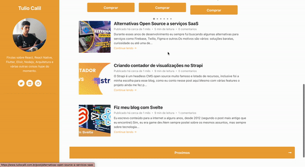

# Blog Frontend Sveltekit | [](https://app.netlify.com/sites/tulio-blog/deploys)

<div align="center">




</div>

Frontend do blog https://tuliocalil.com.br desenvolvido em Svelte.
Veja o [post do blog](https://www.tuliocalil.com.br/post/fiz-meu-blog-com-svelte) com a explicação completa do projeto.

## Features

- Sveltekit
- Listagem de postagens com paginação (isso é uma feature ?).
- Layout responsivo (isso é uma feature ?).
- Comentarios e contador de comentarios nas postagens.
- Tempo de leitura do post.
- Google Analytics.
- Google Performance Monitor.
- Image Lazy load e placeholder.
- Pagina de erro customizada.
- Code highlight.
- Image zoom.
- Reações nas postagens.
- SEO otimizado.
- Preview ao compartilhar links.
- Botoes de compartilhamento nas postagens.
- Carrousel de ofertas (Amazon).
- Sitemap automatico.

## Roadmap

- [ ] Atualizar Sveltekit.
- [ ] Criar pagina de sobre.
- [ ] Implementar tags nos posts.
- [ ] Listar tags na sidebar.
- [ ] Adicionar shimmer na sidebar.
- [ ] Configurar newsletter.
- [x] Adicionar botão de compartilhar.
- [x] Implementar minutos de leitura nas postagens.
- [x] Usar/refatorar writable stores para infos basicas do blog (nome, descricao, etc).
- [x] Refatorar para typescript
- [x] Melhorar acessibilidade
- [x] Melhorar SEO
- [x] Criar feature toggle
- [x] Adicionar Social meta tags

## Como rodar

Clone o projeto:

```bash
git clone git@github.com:tuliocll/blog-svelte.git
```

Instale as dependencias:

```bash
yarn install
```

Configure o .env.

```bash
cp .env.example .env
```

> Serviços de terceiro:

- Crie uma conta no [Cusdis](https://cusdis.com/) para usar os comentarios.

- Crie uma conta no Google Analytics e [pegue o codigo do GA para usar.](https://developers.google.com/analytics/devguides/reporting/core/v4?hl=pt_br)

- Crie uma conta no Firebase e configure as Envs.

- Para rodar em modo de desenvolvimento:

```
yarn dev
```

## Deploy

```bash
yarn build
```

<div align="center">

### Made with 💙 in Bahia, Brasil.

</div>
